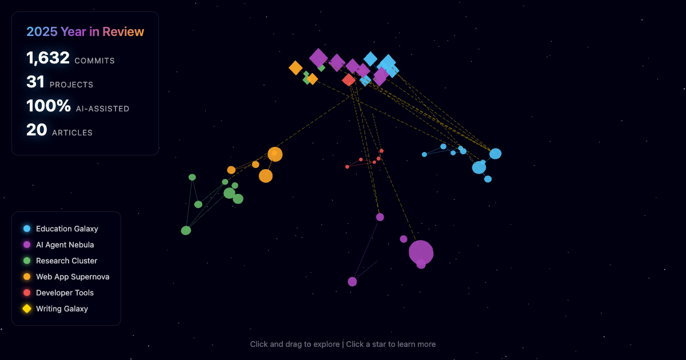

# 2025 Year in Review

**A 3D constellation visualization of what I built in 2025 with AI assistance.**

[**View Live Demo**](https://vishalsachdev.github.io/2025-in-review/)



## Overview

An interactive 3D star map where each star represents a project built during 2025. Projects are grouped into themed constellations that you can explore, click, and learn about.

**Stats:**
- **30 projects** across 5 constellations
- **~1,700 commits** in 2025
- **100% AI-assisted** (Claude Code)

## The Constellations

| Constellation | Theme | Projects |
|--------------|-------|----------|
| ⭐ **Education Galaxy** | Teaching tools | intelligent-textbooks, canvas-mcp, badm554-api, nano-hack, superpower, badm350-ai-learning-tools, claude-code-for-business, api-demo, database-management |
| 🤖 **AI Agent Nebula** | Chatbots & agents | venturebot, claude-interviewer, entrebot, AgentLab, athen-ai |
| 🔬 **Research Cluster** | Academic research | nber, a2i-curriculum, gdpval, ai-taskforce, aei, ai-impact, icis2025 |
| 🌐 **Web App Supernova** | Full-stack apps | tldw, illinihunt, makerlab, LearnByEmail, practicum |
| 🛠️ **Developer Tools** | Meta-tooling | llms-txt, claude-soul-viz, waymo-calculator, helloworld, linkedin |

## Features

- **3D constellation map** - Stars sized by commit count, colored by theme
- **Interactive exploration** - Click and drag to navigate, scroll to zoom
- **Project details** - Click any star to see description, commits, dates, and GitHub link
- **Article links** - Some projects link to related [Substack articles](https://chatwithgpt.substack.com/s/the-hybrid-builder)
- **Guided tour** - Optional auto-fly through each constellation with narration
- **Stats overlay** - Live counts of commits, projects, and AI-assisted percentage

## Related Articles

Some projects have associated articles on [The Hybrid Builder](https://chatwithgpt.substack.com/s/the-hybrid-builder):

- [Teaching Database Management in the Age of AI Assistants](https://chatwithgpt.substack.com/p/teaching-database-management-in-the) - canvas-mcp, database-management
- [Connecting the Dots with Grok](https://chatwithgpt.substack.com/p/connecting-the-dots-with-grok-a-case) - venturebot, AgentLab

## Run Locally

```bash
# Clone the repo
git clone https://github.com/vishalsachdev/2025-in-review.git
cd 2025-in-review

# Option 1: Open directly
open index.html

# Option 2: Use a local server (recommended)
python -m http.server 8000
# Then visit http://localhost:8000
```

## Tech Stack

- **Three.js** - 3D rendering and scene management
- **Vanilla JavaScript** - No framework dependencies
- **CSS** - Custom styling with glassmorphism effects
- **GitHub Pages** - Static hosting

## Project Structure

```
2025-in-review/
├── index.html          # Main entry point
├── css/styles.css      # All styling
├── js/
│   ├── data.js         # Repo data and constellation config
│   ├── scene.js        # Three.js scene setup
│   ├── constellations.js # Star rendering logic
│   ├── controls.js     # User interactions
│   ├── tour.js         # Guided tour mode
│   └── main.js         # App initialization
└── README.md
```

## Credits

Built with [Claude Code](https://claude.com/claude-code) - an AI-assisted development workflow.

This project is itself a testament to what's possible when human creativity meets AI collaboration.

---

*"The best way to predict the future is to build it."*
